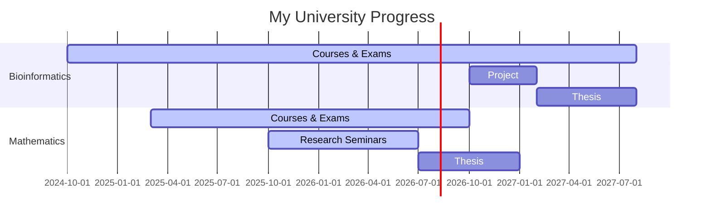
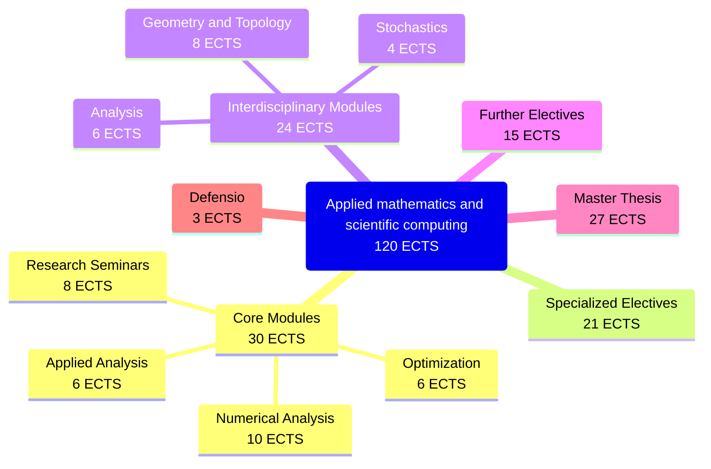
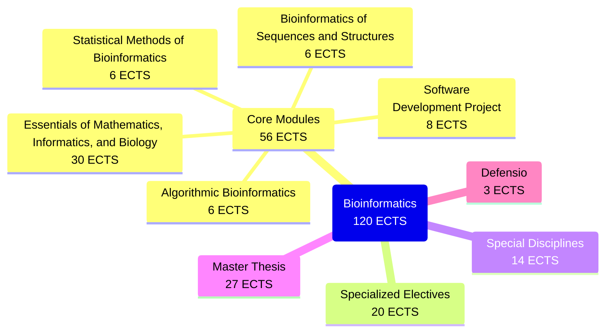

The European freedom in education has a downside. If you’re an idiot like me, don’t know what you want, and aren’t confident in the success of your endeavors, there’s a chance you’ll spread yourself too thin trying to do everything at once. So, after giving it a lot of thought, I decided to somehow pin down a concrete study plan for myself.

For now, it looks like this.

I really want to finish both master’s programs for two reasons. Firstly, I simply find them interesting. Secondly, it seems to me that many *gebildete Personen* in Austria have more than one degree, and since I want to integrate into that part of Austrian society, I need to work harder than the average student.

## Master Mathematics

My primary interest lies in applied mathematics. I devote most of my time and effort to this field, in other words, it is my top priority. The curriculum of this program can, in general, be represented by the following diagram.

My current course progress and overall impressions are summarized in the table below.

  <table class="course-table">
    <thead>
      <tr>
        <th>Course</th>
        <th style="text-align: center;">Type</th>
        <th style="text-align: center;">ECTS</th>
        <th style="text-align: center;">Grade</th>
      </tr>
    </thead>
    <tbody>
      <!-- Advanced Numerical Analysis -->
      <tr class="course-row" data-id="m1">
        <td style="padding-right: 200px;">Advanced Numerical Analysis</td>
        <td style="width: 100px; text-align: center;">VO</td>
        <td style="width: 100px; text-align: center;">7</td>
        <td style="width: 100px; text-align: center;">1</td>
      </tr>
      <tr></tr>
      <tr class="course-row" data-id="m1">
        <td style="color: transparent;">Advanced Numerical Analysis</td>
        <td style="text-align: center;">PS</td>
        <td style="text-align: center;">4</td>
        <td class="course-status-progress">In progress</td>
      </tr>
      <tr class="course-details" data-id="m1">
        <td colspan="2">
          

            

              
Lecturer:

              

                Assoz.-Prof. Dr. Vladimir Kazeev
              

            

            

              
Tutor:

              

                Dr. Enrico Zampa
              

            

            

              
Semester:

              

                PS in 2026S, VO in 2025S
              

            

            

              
Description:

              

                <a href="https://ufind.univie.ac.at/de/course.html?lv=250071&semester=2026S" target="_blank">📖 u:find PS</a>, <a href="https://ufind.univie.ac.at/de/course.html?lv=250078&semester=2025S" target="_blank">📖 u:find VO</a>
              

            

          

        </td>
        <td colspan="2"></td>
      </tr>
      <!-- Nonlinear Optimization -->
      <tr class="course-row" data-id="m2">
        <td>Nonlinear Optimization</td>
        <td style="text-align: center;">VO</td>
        <td style="text-align: center;">6</td>
        <td style="text-align: center;">1</td>
      </tr>
      <tr></tr>
      <tr class="course-row" data-id="m2">
        <td style="color: transparent;">Nonlinear Optimization</td>
        <td style="text-align: center;">PS</td>
        <td style="text-align: center;">4</td>
        <td style="text-align: center;">2</td>
      </tr>
      <tr class="course-details" data-id="m2">
        <td colspan="2">
          

            

              
Lecturer:

              

                Univ.-Prof. Dr. Radu Ioan Bot
              

            

            

              
Tutor:

              

                Mag. Chiara Schindler
              

            

            

              
Semester:

              

                2025W
              

            

            

              
Description:

              

                <a href="https://ufind.univie.ac.at/de/course.html?lv=250049&semester=2025W" target="_blank">📖 u:find PS</a>, <a href="https://ufind.univie.ac.at/de/course.html?lv=250010&semester=2025W" target="_blank">📖 u:find VO</a>
              

            

          

        </td>
        <td colspan="2">
          <a href="/assets/posts/my-uni-wien/NonLinOpt.pdf" target="_blank">🧾 Lecture Notes</a>
        </td>
      </tr>
      <!-- Applied Analysis -->
      <tr class="course-row" data-id="m3">
        <td>Applied Analysis</td>
        <td style="text-align: center;">VO</td>
        <td style="text-align: center;">6</td>
        <td class="course-status-progress">In Progress</td>
      </tr>
      <tr class="course-details" data-id="m3">
        <td colspan="2">
          

            

              
Lecturers:

              

                Priv.-Doz. Dr. Monika Dörfler, 
                Univ.-Prof. Dr. Norbert Mauser, 
                Dr. Hans Peter Stimming
              

            

            

              
Semester:

              

                2025W
              

            

            

              
Description:

              

                <a href="https://ufind.univie.ac.at/de/course.html?lv=250009&semester=2025W" target="_blank">📖 u:find</a>
              

            

          

        </td>
        <td colspan="2">
          <a href="/assets/posts/my-uni-wien/AppAnP1.pdf" target="_blank">🧾 Lecture Notes: Part 1</a>, 
          <a href="/assets/posts/my-uni-wien/AppAnP2.pdf" target="_blank">🧾 Lecture Notes: Part 2</a>
        </td>
      </tr>
      <!-- Optimization Seminar -->
      <tr class="course-row" data-id="m4">
        <td>Optimization</td>
        <td style="text-align: center;">SE</td>
        <td style="text-align: center;">4</td>
        <td style="text-align: center;">1</td>
      </tr>
      <tr class="course-details" data-id="m4">
        <td colspan="2">
          

            

              
Supervisor:

              

                Assoz.-Prof. Dr. Hermann Schichl
              

            

            

              
Semester:

              

                2025W
              

            

            

              
Description:

              

                <a href="https://ufind.univie.ac.at/de/course.html?lv=250101&semester=2025W" target="_blank">📖 u:find</a>
              

            

          

        </td>
        <td colspan="2">
          <a href="/assets/posts/my-uni-wien/SemOpt.pdf" target="_blank">🎓 Seminar Work</a>
        </td>
      </tr>
      <!-- Seminar Applied Mathematics -->
      <tr class="course-row" data-id="m5">
        <td>Applied Mathematics</td>
        <td style="text-align: center;">SE</td>
        <td style="text-align: center;">4</td>
        <td class="course-status-progress">In Progress</td>
      </tr>
      <tr class="course-details" data-id="m5">
        <td colspan="2">
          

            

              
Superviser:

              

                Univ.-Prof. Dr. Norbert Mauser
              

            

            

              
Semester:

              

                2026S
              

            

            

              
Description:

              

                <a href="https://ufind.univie.ac.at/de/course.html?lv=250094&semester=2026S" target="_blank">📖 u:find</a>
              

            

          

        </td>
        <td colspan="2">
          <!-- <a href="TODO" target="_blank">TODO</a> -->
        </td>
      </tr>
      <!-- Convex Optimization -->
      <tr class="course-row" data-id="m6">
        <td style="padding-right: 200px;">Convex Optimization</td>
        <td style="text-align: center;">VO</td>
        <td style="text-align: center;">6</td>
        <td style="text-align: center;">1</td>
      </tr>
      <tr class="course-details" data-id="m6">
        <td colspan="2">
          

            

              
Lecturer:

              

                Univ.-Prof. Dr. Radu Ioan Bot
              

            

            

              
Semester:

              

                2025S
              

            

            

              
Description:

              

                <a href="https://ufind.univie.ac.at/de/course.html?lv=250100&semester=2025S" target="_blank">📖 u:find</a>
              

            

          

        </td>
        <td colspan="2">
        </td>
      </tr>
      <!-- Kinetic theory app to bio -->
      <tr class="course-row" data-id="m7">
        <td>Kinetic Theory Applied to Biology</td>
        <td style="text-align: center;">VU</td>
        <td style="text-align: center;">7</td>
        <td style="text-align: center;">1</td>
      </tr>
      <tr class="course-details" data-id="m7">
        <td colspan="2">
          

            

              
Lecturer:

              

                Univ.-Prof. Dr. Sara Merino Aceituno
              

            

            

              
Semester:

              

                2025S
              

            

            

              
Description:

              

                <a href="https://ufind.univie.ac.at/de/course.html?lv=250043&semester=2025S" target="_blank">📖 u:find</a>
              

            

          

        </td>
        <td colspan="2">
        </td>
      </tr>
      <!-- Mathematical PopGen -->
      <tr class="course-row" data-id="m8">
        <td>Mathematical Population Genetics</td>
        <td style="text-align: center;">VO</td>
        <td style="text-align: center;">5</td>
        <td style="text-align: center;">2</td>
      </tr>
      <tr class="course-details" data-id="m8">
        <td colspan="2">
          

            

              
Lecturer:

              

                Univ.-Prof. Dr. Emmanuel Schertzer
              

            

            

              
Semester:

              

                2025S
              

            

            

              
Description:

              

                <a href="https://ufind.univie.ac.at/de/course.html?lv=250106&semester=2025S" target="_blank">📖 u:find</a>
              

            

          

        </td>
        <td colspan="2">
          <a href="/assets/posts/my-uni-wien/PopGen.pdf" target="_blank">🧾 Lecture Notes</a>
        </td>
      </tr>
      <!-- Low Dimensional Topology -->
      <tr class="course-row" data-id="m9">
        <td>Low Dimensional Topology</td>
        <td style="text-align: center;">VO</td>
        <td style="text-align: center;">6</td>
        <td style="text-align: center;">1</td>
      </tr>
      <tr class="course-details" data-id="m9">
        <td colspan="2">
          

            

              
Lecturer:

              

                Assoz.-Prof. Dr. Vera Vértesi
              

            

            

              
Semester:

              

                2025S
              

            

            

              
Description:

              

                <a href="https://ufind.univie.ac.at/de/course.html?lv=250150&semester=2025S" target="_blank">📖 u:find</a>
              

            

          

        </td>
        <td colspan="2"></td>
      </tr>
      <!-- Stochastic Processes -->
      <tr class="course-row" data-id="m10">
        <td>Stochastic Processes</td>
        <td style="text-align: center;">VO</td>
        <td style="text-align: center;">6</td>
        <td style="text-align: center;">2</td>
      </tr>
      <tr class="course-details" data-id="m10">
        <td colspan="2">
          

            

              
Lecturer:

              

                Univ.-Prof. Dr. Nathanael Berestycki
              

            

            

              
Semester:

              

                2025W
              

            

            

              
Description:

              

                <a href="https://ufind.univie.ac.at/de/course.html?lv=250042&semester=2025W" target="_blank">📖 u:find</a>
              

            

          

        </td>
        <td colspan="2">
          <a href="/assets/posts/my-uni-wien/StPr.pdf" target="_blank">🧾 Lecture Notes</a>
        </td>
      </tr>
      <!-- Advanced Measure Theory -->
      <tr class="course-row" data-id="m11">
        <td>Advanced Measure Theory</td>
        <td style="text-align: center;">VO</td>
        <td style="text-align: center;">6</td>
        <td style="text-align: center;">2</td>
      </tr>
      <tr class="course-details" data-id="m11">
        <td colspan="2">
          

            

              
Lecturer:

              

                Univ.-Prof. Dr. Hendrik Bruin
              

            

            

              
Semester:

              

                2025W
              

            

            

              
Description:

              

                <a href="https://ufind.univie.ac.at/de/course.html?lv=250041&semester=2025W" target="_blank">📖 u:find</a>
              

            

          

        </td>
        <td colspan="2"></td>
      </tr>
    </tbody>
  </table>

  <!-- DESCRIPTIONS -->
  <!-- Advanced Numerical Analysis -->
  

    

      
TODO

    

  

  <!-- Nonlinear Optimization -->
  

    

      
The course wasn’t difficult, but it was quite extensive. Professor Boţ provided excellent lecture notes, which made preparing for the exam enjoyable. It’s always nice when mathematical texts are rigorous.
      

      
Ms. Schindler was very understanding toward me. Because of stomach issues, I missed a number of seminars, and she agreed to let me complete them individually. And honestly, besides being very smart, she’s also really charming. Yeah, that sounds a bit cringe, but it’s true!
      

    

  

  <!-- Applied Analysis -->
  

    

      TODO
    

  

  <!-- Seminar Optimization -->
  

    

      There were only five of us, so there was no pressure — you just study a topic, present it, and enjoy the process. I had the most applied topic, and I feel like it didn’t really resonate with many people. But I found it interesting, even though it was challenging.
    

  

  <!-- Seminar Applied Mathematics -->
  

    

      TODO
    

  

  <!-- Convex Optimization -->
  

    

      The course was difficult and extensive. Professor Boţ is a veeeery strict guy, which made the lectures challenging and, as a consequence, interesting. These were my first lectures at the Faculty of Mathematics at the University of Vienna, so yeah — very warm memories.
    

  

  <!-- Kinetic theory app to bio -->
  

    

      
The course was interesting, and the problems were enjoyable to work through. But at some point, closer to the end, it felt like we got stuck in one place. There was quite a lot of hand-waving, which personally annoys me, though it’s understandable — otherwise the course would probably have been impossible to manage.
      

      
Although, to be fair, it <i>would</i> have been possible, but only with a huge amount of extra effort put into the course. The professor was already trying her best.
      

    

  

  <!-- Mathematical Population Genetics -->
  

    

      

        “The sexual reproducing is very boring.” © E. Scherzer
      

      

        The lectures were good, and the lecturer was just pure flex. But the subject itself… Before this course, I thought I would specialize in biomathematics, but after taking it — no, please no.
      

    

  

  <!-- Low Dimensional Topology -->
  

    

      

        I absolutely love topology. At the same time, topology <i>courses</i> drive me crazy. It often feels impossible to prove anything rigorously — doing everything properly would probably take 120 ECTS credits for a single course alone. On the bright side, I finally managed to understand Khovanov homology, which became the topic of my presentation.
      

    

  

  <!-- Stochastic Processes -->
  

    

        I did not attend the classes. I had already taken a course in stochastic processes in Russia, so before the exam here I just spent four hours going through the lecture notes and then went in to take the exam.
    

  

  <!-- Advanced Measure Theory -->
  

    

      

        Unfortunately, because of scheduling conflicts, I was unable to attend the classes, so I mostly studied from the recommended textbooks on my own. To be honest, I was disappointed after the exam. I had expected more from myself. Forgetting a proof that I had memorized beforehand was rather embarrassing.
      

      

        At least now I am certain that, regardless of the circumstances — and under any New Year’s tree — I can define the Lebesgue integral.
      

    

  

## Master Bioinformatics

This is my second field of study. Mathematics is certainly fascinating, but if an academic career does not work out, one still needs to earn a living, which is why I have placed some hopes in a degree in Computer Science. The curriculum here is less flexible and looks as follows.

Even though this is technically the program through which my residence permit is being extended by the local authorities, and although it would probably be wiser to prioritize it instead, I do not devote nearly as much time and effort to it. Nevertheless, my progress is summarized in the table below.

  <table class="course-table">
    <thead>
      <tr>
        <th>Course</th>
        <th style="text-align: center;">Type</th>
        <th style="text-align: center;">ECTS</th>
        <th style="text-align: center;">Grade</th>
      </tr>
    </thead>
    <tbody>
      <!-- Essential Mathematics for Bioinformatics -->
      <tr class="course-row" data-id="b1">
        <td>Essential Mathematics for Bioinformatics</td>
        <td style="text-align: center;">Module Exam</td>
        <td style="text-align: center;">10</td>
        <td style="text-align: center;">1</td>
      </tr>
      <tr class="course-details" data-id="b1">
        <td colspan="2">
          

            

              
Examiner:

              

                Univ.-Prof. Dr. Ivo Hofacker
              

            

            

              
Semester:

              

                2024W
              

            

          

        </td>
        <td colspan="2">
        </td>
      </tr>
      <!-- Essential Computer Science for Bioinformatics -->
      <tr class="course-row" data-id="b2">
        <td>Essential Computer Science for Bioinformatics</td>
        <td style="text-align: center;">Module Exam</td>
        <td style="text-align: center;">10</td>
        <td style="text-align: center;">3</td>
      </tr>
      <tr class="course-details" data-id="b2">
        <td colspan="2">
          

            

              
Examiner:

              

                Dr. Heiko Andreas Schmidt
              

            

            

              
Semester:

              

                2024W
              

            

          

        </td>
        <td colspan="2">
        </td>
      </tr>
      <!-- Essential Biology for Bioinformatics -->
      <tr class="course-row" data-id="b3">
        <td>Essential Biology for Bioinformatics</td>
        <td style="text-align: center;">Module Exam</td>
        <td style="text-align: center;">10</td>
        <td style="text-align: center;">3</td>
      </tr>
      <tr class="course-details" data-id="b3">
        <td colspan="2">
          

            

              
Examiner:

              

                Dr. Stefan Badelt
              

            

            

              
Semester:

              

                2026S
              

            

          

        </td>
        <td colspan="2">
        </td>
      </tr>
      <!-- Fundamentals in Systems Biology -->
      <tr class="course-row" data-id="b4">
        <td>Fundamentals in Systems Biology</td>
        <td style="text-align: center;">VO</td>
        <td style="text-align: center;">3</td>
        <td style="text-align: center;">1</td>
      </tr>
      <tr class="course-details" data-id="b4">
        <td colspan="2">
          

            

              
Lecturers:

              

                Assoz.-Prof. Dr. Christoph Flamm, 
                Priv.-Doz. Dr. Stefanie Widder
              

            

            

              
Semester:

              

                2025W
              

            

            

              
Description:

              

                <a href="https://ufind.univie.ac.at/de/course.html?lv=301696&semester=2025W" target="_blank">📖 u:find</a>
              

            

          

        </td>
        <td colspan="2">
        </td>
      </tr>
      <!-- Computational Structural Biology -->
      <tr class="course-row" data-id="b5">
        <td>Computational Structural Biology</td>
        <td style="text-align: center;">VO</td>
        <td style="text-align: center;">3</td>
        <td style="text-align: center;">4</td>
      </tr>
      <tr class="course-details" data-id="b5">
        <td colspan="2">
          

            

              
Lecturer:

              

                Univ.-Prof. Dr. Bojan Zagrovic
              

            

            

              
Semester:

              

                2026S
              

            

            

              
Description:

              

                <a href="https://ufind.univie.ac.at/de/course.html?lv=301232&semester=2026S" target="_blank">📖 u:find</a>
              

            

          

        </td>
        <td colspan="2"></td>
      </tr>
    </tbody>
  </table>

  <!-- DESCRIPTIONS -->
  <!-- Essential Mathematics for Bioinformatics -->
  

    

      
Easy

    

  

  <!-- Essential Computer Science for Bioinformatics -->
  

    

      During the practical part of the exam, I had to deal with a German keyboard layout for the first time in my life.
    

  

  <!-- Essential Biology for Bioinformatics -->
  

    

      

        Instead of properly studying for the exam, I spent my time writing free verse to a girl who had absolutely no interest in me. Walking into the exam, my attitude was basically:
      

      

        “Well, A–T and G–C — what else could they possibly want from me?”
      

      

        In the end, I only passed on my second attempt.
      

    

  

  <!-- Fundamentals in Systems Biology -->
  

    

      

        Professor Flamm is a saint. Besides the lecture slides, he also provided LaTeX handouts.
      

      

        ABSOLUTE RESPECT.
      

    

  

  <!-- Computational Structural Biology -->
  

    

      

        The lectures were organized as an intensive two-week block, with classes every day from 9 a.m. to noon. It completely disrupted my schedule, so I ended up not attending.
      

      

        I basically just went through the slides. No offense to the professor — he is genuinely awesome and extremely busy — but the slides were awful.
      

    

  

I am doing my best, even though it may still not be enough. I hope everything works out in the end. My mother and grandmother support me financially throughout all of this, so I would feel terribly guilty if I failed.

